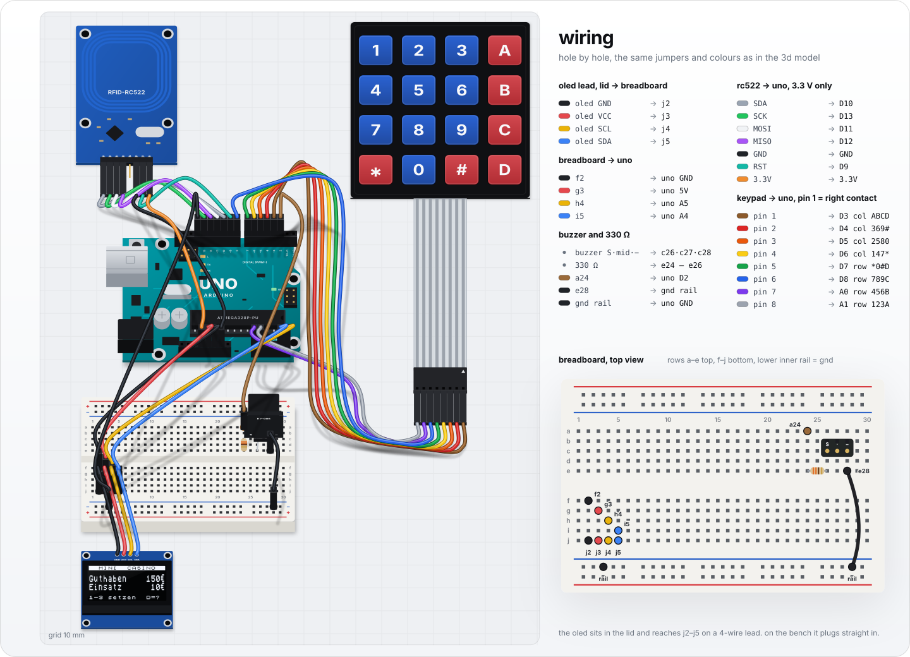
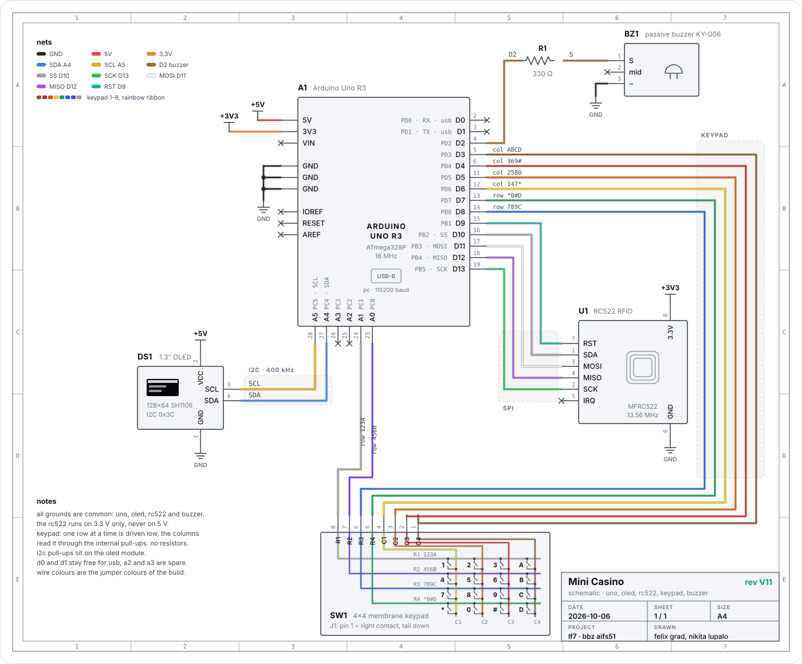
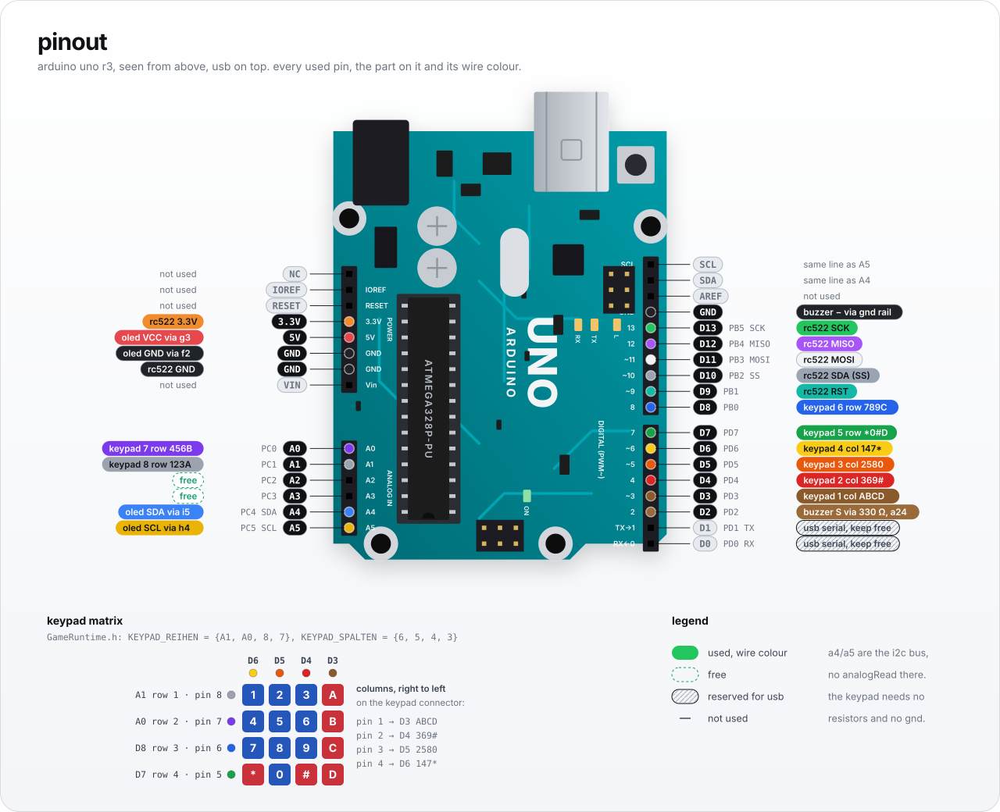
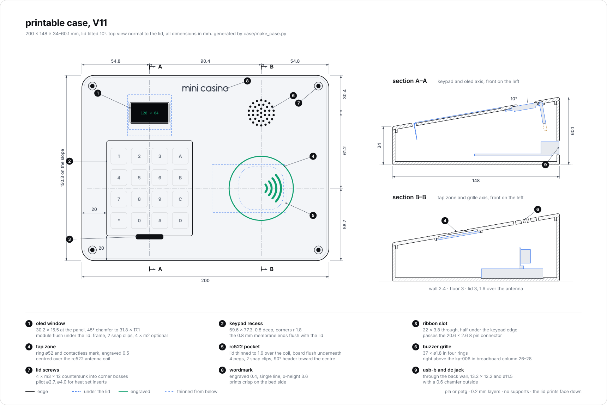

  <picture>
    <source media="(max-width: 600px) and (prefers-color-scheme: dark)" srcset="docs/banner-narrow-dark.svg">
    <source media="(max-width: 600px)" srcset="docs/banner-narrow-light.svg">
    <source media="(prefers-color-scheme: dark)" srcset="docs/banner-dark.svg">
    
  </picture>

a tiny casino on an arduino uno. tap an rfid card, pick black, red or green on the keypad, watch the colours spin on the oled and let the buzzer celebrate. balances live in the uno's eeprom, so the card is just your key.

**[▶ open the 3d model in your browser](https://bbz-aifs51.github.io/LF7-MiniCasino/)**. it plays the game with the real firmware logic, shows every part and wire and has the admin panel built in.

  <picture>
    <source media="(max-width: 600px) and (prefers-color-scheme: dark)" srcset="docs/how-it-works-narrow-dark.svg">
    <source media="(max-width: 600px)" srcset="docs/how-it-works-narrow-light.svg">
    <source media="(prefers-color-scheme: dark)" srcset="docs/how-it-works-dark.svg">
    
  </picture>

## parts

| part | notes |
|---|---|
| arduino uno r3 | atmega328p, usb to the pc, admin protocol at 115200 baud |
| 1.3" oled 128x64 | sh1106 or ssd1306, i2c 0x3c, 4 pins: gnd vcc scl sda |
| rc522 rfid reader | 13.56 mhz, 3.3 v only. any mifare card, fob or ntag works as key |
| 4x4 membrane keypad | 8 pins, no resistors, no gnd. 1 / 2 / 3 bet on black, red, green |
| passive buzzer module + 330 Ω | 3 pins (s, middle, −), plays the jingles |
| half size breadboard, jumpers | 11 female–male, 15 male–male |

## wiring

| part | pin | uno |
|---|---|---|
| oled | gnd / vcc / scl / sda | gnd / 5v / a5 / a4, over the breadboard j2–j5 |
| keypad | 1 / 2 / 3 / 4, columns abcd · 369# · 2580 · 147\* | d3 / d4 / d5 / d6 |
| keypad | 5 / 6 / 7 / 8, rows \*0#d · 789c · 456b · 123a | d7 / d8 / a0 / a1 |
| rc522 | sda / sck / mosi / miso / rst | d10 / d13 / d11 / d12 / d9 |
| rc522 | gnd / 3.3v, irq stays free | gnd / 3.3v, never 5v |
| buzzer | s over 330 Ω, − to the gnd rail | d2 |

keypad pin 1 is the right contact when you look at the keys with the tail down. a2 and a3 are free, d0 and d1 stay free for usb. the breadboard hole by hole is in [UMBAU_OLED.md](UMBAU_OLED.md) and in the picture.

  <picture>
    <source media="(prefers-color-scheme: dark)" srcset="docs/wiring-dark.svg">
    
  </picture>

  <picture>
    <source media="(prefers-color-scheme: dark)" srcset="docs/schematic-dark.svg">
    
  </picture>

  <picture>
    <source media="(prefers-color-scheme: dark)" srcset="docs/pinout-dark.svg">
    
  </picture>

## get it running

1. nothing to install: the oled and rc522 drivers live in the sketch folder.
2. upload `Hardware_Test/Hardware_Test.ino` once to check the oled, the reader and the keypad.
3. open `MiniCasino/MiniCasino.ino`, pick arduino uno and your port, upload.
4. tap a card. new cards get 100 points, then press 1, 2 or 3. a types a new stake, b logs out, c is the volume, d the help.

## the game

* the stake starts at 10 and goes up to 2550 in steps of 10 (key a). black and red pay 2x, green pays 9x. odds are 45 / 45 / 10 %
* a session ends after 60 s without a key press, tap the card again to continue
* up to 31 cards fit into the eeprom, every account keeps two crc protected copies

switches at the top of the sketch: `CASINO_SOUND_MODE` (0 off, 1 passive, 2 active buzzer), `CASINO_EURO` (€ or pkt on the display), `CASINO_OLED_SSD1306` (0 sh1106, 1 ssd1306), `CASINO_SIM` (run without the rc522), `CASINO_NACHLADEN` (refill all accounts once) and `CASINO_EEPROM_LOESCHEN` (wipe everything once).

## extras

* **admin panel**: double click `Panel starten.bat` (or run `python admin/panel.py`) and open http://127.0.0.1:8080. see and edit every balance over usb, ban cards or make one an admin card with unlimited credit. works on a raspberry pi too.
* **no hardware yet?** run `python simulation/build_sim.py` and paste the output into [wokwi](https://wokwi.com). four buttons stand in for the cards. details in [simulation/README.md](simulation/README.md).
* **build check**: `python pruefen.py` compiles for the uno and runs the compile time tests, no upload needed.

## case

a 3d printable console for the whole build, two parts, no supports. stl files, the parametric model and the print notes live in [case/](case/README.md).

**[▶ open the 3d model in your browser](https://bbz-aifs51.github.io/LF7-MiniCasino/)**. the same page lives in the repo as [case/viewer/index.html](case/viewer/index.html) and works offline.

  

## more docs (german)

[UMBAU_OLED.md](UMBAU_OLED.md) oled build · [ANLEITUNG.md](ANLEITUNG.md) wiring in detail · [SPIELPLAN_V8.md](SPIELPLAN_V8.md) rules and pins · [SOUND_V9.md](SOUND_V9.md) buzzer · [LOG_ANLEITUNG.md](LOG_ANLEITUNG.md) serial log · [TESTPLAN.md](TESTPLAN.md) test plan

## credits and license

made by **FelixTheDev - Felix Grad** ([felixthedev.com](https://felixthedev.com)) and **derfacn** ([derfacn.com](https://derfacn.com)), lf7 project, bbz aifs51.

licensed under the [Mini Casino Attribution License](LICENSE): you may use, copy and change everything, but every copy, fork or public use has to credit FelixTheDev - Felix Grad and derfacn visibly and link [felixthedev.com](https://felixthedev.com) and [derfacn.com](https://derfacn.com).

 the graphics and the schematic are generated by `docs/make_graphics.py` straight from the firmware and the case model.
