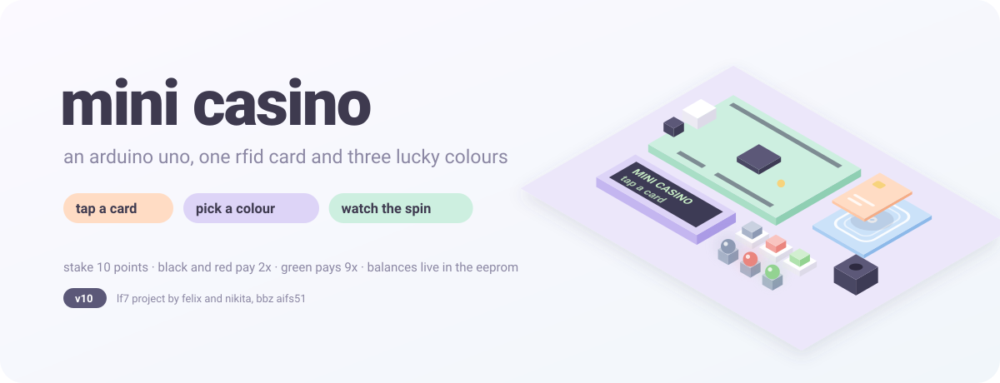
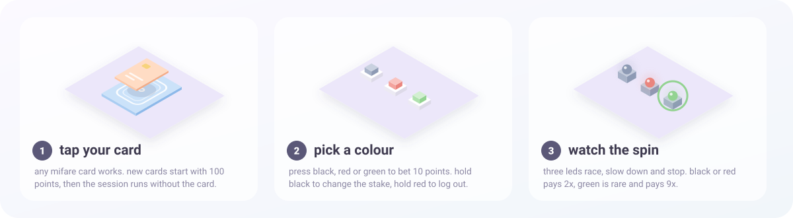
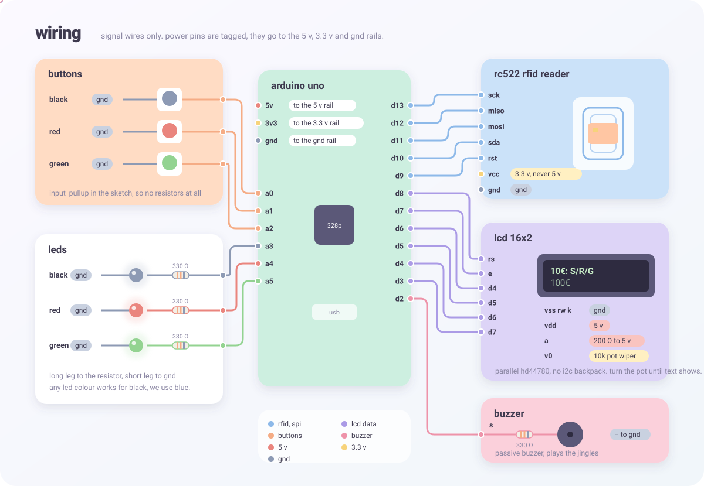

  

a tiny casino on an arduino uno. tap an rfid card, pick black, red or green, watch the colours spin on the oled and let the buzzer celebrate. balances live in the uno's eeprom, so the card is just your key.

  

## parts

| part | notes |
|---|---|
| arduino uno | atmega328p |
| rc522 rfid reader | runs on 3.3 v, any mifare card or tag works as key |
| 1.3" oled 128x64 | i2c, 4 pins (gnd vcc scl sda), sh1106 or ssd1306 |
| 4x4 membrane keypad | 8 pins, keys 1 / 2 / 3 stand for black, red, green |
| passive buzzer + 330 Ω | optional, plays the jingles |

## wiring

| part | uno |
|---|---|
| oled gnd / vcc / scl / sda | gnd / 5v / a5 / a4 |
| keypad pins 1–8 | d3 / d4 / d5 / d6 / d7 / d8 / a0 / a1 |
| buzzer | d2 over 330 Ω |
| rc522 sda / rst / mosi / miso / sck | d10 / d9 / d11 / d12 / d13, gnd to gnd, 3.3v to 3.3 v |

the breadboard hole by hole is in [UMBAU_OLED.md](UMBAU_OLED.md). the picture below still shows the old lcd build with leds.

  

## get it running

1. nothing to install: the oled and rc522 drivers live in the sketch folder.
2. upload `Hardware_Test/Hardware_Test.ino` once to check the oled, the reader and the keypad.
3. open `MiniCasino/MiniCasino.ino`, pick arduino uno and your port, upload.
4. tap a card. new cards get 100 points, then press 1, 2 or 3. a types a new stake, b logs out, c is the volume, d the help.

## the game

* stake is 10 points. black and red pay 2x, green pays 9x. odds are 45 / 45 / 10 %
* a session ends after 60 s without a button press, tap the card again to continue
* up to 31 cards fit into the eeprom, every account keeps two crc protected copies

switches at the top of the sketch: `CASINO_SOUND_MODE` (0 off, 1 passive, 2 active buzzer), `CASINO_EURO` (€ or pkt on the display), `CASINO_OLED_SSD1306` (0 sh1106, 1 ssd1306), `CASINO_SIM` (run without the rc522), `CASINO_NACHLADEN` (refill all accounts once) and `CASINO_EEPROM_LOESCHEN` (wipe everything once).

## extras

* **admin panel**: double click `Panel starten.bat` (or run `python admin/panel.py`) and open http://127.0.0.1:8080. see and edit every balance over usb, ban cards or make one an admin card with unlimited credit. works on a raspberry pi too.
* **no hardware yet?** run `python simulation/build_sim.py` and paste the output into [wokwi](https://wokwi.com). four buttons stand in for the cards. details in [simulation/README.md](simulation/README.md).
* **build check**: `python pruefen.py` compiles for the uno and runs the compile time tests, no upload needed.

## case

a 3d printable console for the whole build, two parts, no supports. stl files, the parametric model and the print notes live in [case/](case/README.md).

**[▶ open the 3d model in your browser](https://bbz-aifs51.github.io/LF7-MiniCasino/)**. it plays the game with the real firmware logic, shows every wire and the electronics inside, and has the admin panel built in. the same page lives in the repo as [case/viewer/index.html](case/viewer/index.html) and works offline.

  

## more docs (german)

[UMBAU_OLED.md](UMBAU_OLED.md) oled build · [ANLEITUNG.md](ANLEITUNG.md) wiring in detail · [SPIELPLAN_V8.md](SPIELPLAN_V8.md) rules and pins · [SOUND_V9.md](SOUND_V9.md) buzzer · [LOG_ANLEITUNG.md](LOG_ANLEITUNG.md) serial log · [TESTPLAN.md](TESTPLAN.md) test plan

lf7 project by felix grad and nikita lupalo, bbz aifs51. the graphics are generated by `docs/make_graphics.py`.
